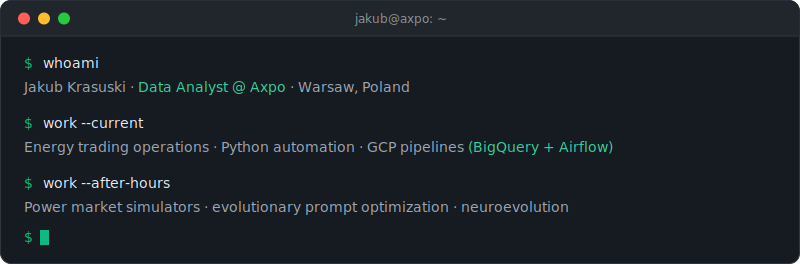

  

  

<h2 align="center">About Me</h2>

  

<h2 align="center">Featured Projects</h2>

  
  
  
  
  
  

    

  
  
  
  
  
  

<h2 align="center">Tech Stack</h2>

  

    
    
    
    
    
    
    
    
  

  

    
    
    
    
    
    
    
    
  

  

    
    
    
    
    
    
    
  

<h2 align="center">GitHub Analytics</h2>

  

    

  
  

    

  

<h2 align="center">Contact</h2>

  
  
  

  

